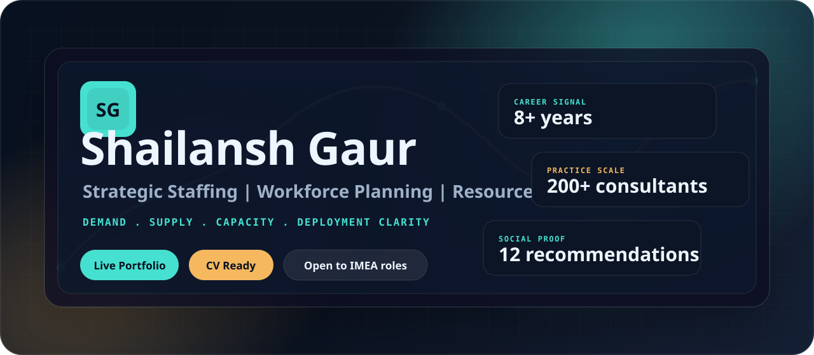

  

  
  
  
  

  

---

## Portfolio Brief

I am a strategic staffing and workforce planning professional with 8+ years across EY and Capgemini, focused on demand forecasting, capacity visibility, resource deployment, utilization governance, and executive-ready workforce insight.

My work turns messy talent movement into a clear operating rhythm: who is needed, who is available, where delivery risk is building, and what decision leaders should make next.

**Live:** [shailanshgaur.github.io](https://shailanshgaur.github.io)  
**CV:** [Shailansh-Gaur-CV.pdf](Shailansh-Gaur-CV.pdf)  
**Location:** Gurugram, India  
**Open to:** Resource management, strategic staffing, workforce planning, and consulting operations roles across Dubai, IMEA, and global teams

---

## Executive Signal

| Signal | Proof |
| --- | --- |
| 8+ years | Resource management, staffing operations, workforce planning, and consulting delivery support across EY and Capgemini. |
| 200+ consultant practice | End-to-end supply-demand management across role intake, shortlist quality, escalation, fulfillment tracking, and visibility. |
| London secondment | Selected for a 3-month EY UK&I secondment to strengthen cross-region alignment between UK&I and GDS teams. |
| 12 recommendations | Client and senior colleague feedback highlighting diligence, resilience, responsiveness, stakeholder trust, and calm execution. |

---

## Operating Model

| 01 Demand | 02 Supply | 03 Capacity | 04 Narrative |
| --- | --- | --- | --- |
| Role intake quality, fulfillment visibility, forecast changes, and escalation discipline. | Bench reviews, skills alignment, resource availability, redeployment options, and shortlist quality. | Chargeability, utilization trends, pipeline pressure, subcontractor visibility, and capacity risk. | Weekly Ops MI that turns workforce data into leadership-ready decisions and practical interventions. |

---

## Experience Map

| Company | Role | High-value themes |
| --- | --- | --- |
| EY | Assistant Manager | UK&I consulting resource management, supply-demand governance, stakeholder reporting, SEMA conversations, role qualification, data quality |
| EY | Senior Consultant, London secondment | Cross-region enablement, forecasting, weekly leadership calls, knowledge transfer, UK&I and GDS operating alignment |
| EY | Senior Consultant | Bench reviews, staffing risk, subcontractor MI, resource availability, utilization reporting, Profinda and Advance+ discipline |
| Capgemini | Associate Consultant / Senior Analyst | Pool staffing, war rooms, URVE improvement, deployment reporting, HR partnership, competency collaboration |

---

## Tools And Platforms

  
  
  
  
  
  
  
  

---

## Recognition

| Recognition | Issuer |
| --- | --- |
| Squad Extraordinaire FY26 | EY Extraordinary You |
| GDS User Recognition | EY UK |
| Highest Performing Team Award | EY GDS |
| EY Spot Award | EY GDS |
| Project Star and Red Carpet recognition | Capgemini |

---

## What People Repeatedly Call Out

> Highly diligent, results focused, and understands the resource management model exceptionally well.

> Resilient, fun to work with, and made my day easier.

> Reliable, responsible, responsive.

> Calm under pressure, detail-oriented, and highly adaptable.

---

  <a href="https://shailanshgaur.github.io">Open portfolio</a>
  &nbsp;|&nbsp;
  <a href="Shailansh-Gaur-CV.pdf">Download CV</a>
  &nbsp;|&nbsp;
  <a href="mailto:gaurshailansh@gmail.com">Start a conversation</a>

