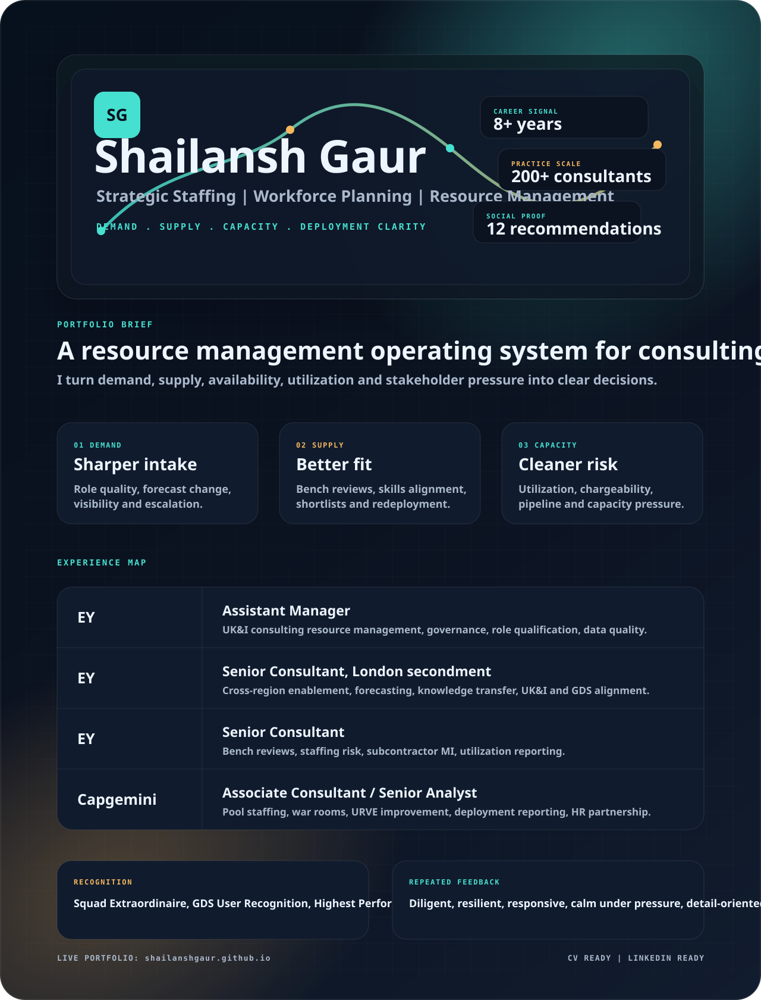

  

  
  
  
  

## Snapshot

Strategic staffing and workforce planning professional with 8+ years across EY and Capgemini, focused on demand forecasting, capacity visibility, resource deployment, utilization governance, and executive-ready workforce insight.

## Links

- Portfolio: [shailanshgaur.github.io](https://shailanshgaur.github.io)
- CV: [Shailansh-Gaur-CV.pdf](Shailansh-Gaur-CV.pdf)
- LinkedIn: [linkedin.com/in/shailanshgaur](https://www.linkedin.com/in/shailanshgaur/)
- Email: [gaurshailansh@gmail.com](mailto:gaurshailansh@gmail.com)
